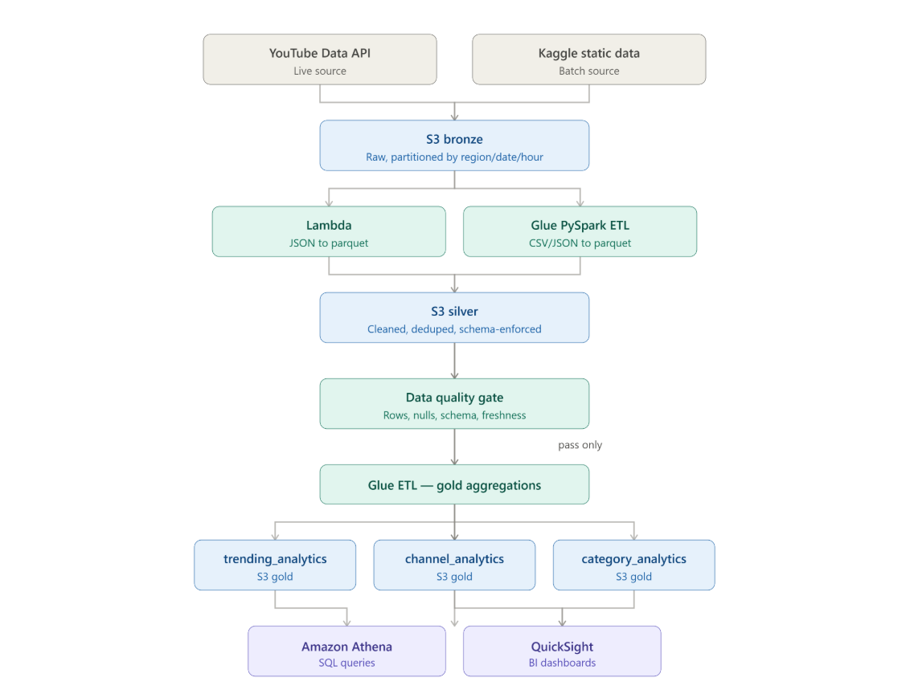
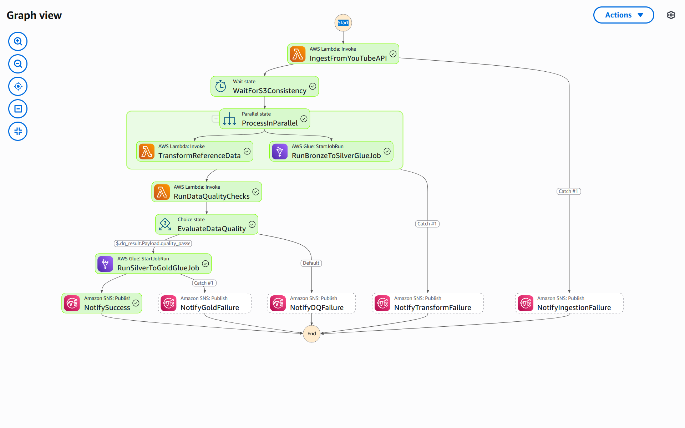

# YouTube Trending Data Analytics Pipeline — AWS (S3 · Glue · Lambda · Athena · Step Functions)

An end-to-end, serverless data engineering pipeline on AWS that ingests YouTube trending video data — live via the **YouTube Data API v3**, plus a static Kaggle dataset — processes it through a medallion architecture (Bronze → Silver → Gold), runs automated data quality gating, and produces analytics-ready tables queryable via Amazon Athena. Fully orchestrated with AWS Step Functions, with SNS alerting on every failure branch.

---

## Tech Stack


---

## Architecture



```
YouTube Data API ─┐
                   ├─► S3 Bronze (raw JSON/CSV, partitioned by region/date/hour)
Kaggle static data ┘
        │
        ▼
  Lambda (JSON → Parquet)   +   Glue PySpark ETL (CSV/JSON → Parquet)
        │
        ▼
  S3 Silver (cleaned, deduplicated, schema-enforced Parquet)
        │
        ▼
  Lambda Data Quality Gate — row count, null %, schema, value range, freshness (via Athena)
        │
        ▼  (pass only)
  Glue PySpark ETL (Silver → Gold aggregations)
        │
        ▼
  S3 Gold — trending_analytics · channel_analytics · category_analytics
        │
        ▼
  Amazon Athena (SQL) / QuickSight (BI)

Entire flow orchestrated by AWS Step Functions. SNS alert on every failure branch.
```

| Layer | Tool | What happens |
|---|---|---|
| Source | YouTube Data API v3 + Kaggle CSV/JSON | Live trending videos + category metadata, per region |
| Ingestion | Lambda (`yt-lambda-ingestion`) | Pulls trending + category data, writes raw JSON to Bronze, Hive-partitioned |
| Bronze | S3 | Raw data as-is, lifecycle rule archives to Glacier after 90 days |
| Silver | Lambda + Glue (PySpark) | Schema enforcement, dedup, date parsing, derived metrics (`like_ratio`, `engagement_rate`) |
| Quality Gate | Lambda + Athena | 5 automated checks block Gold if data fails |
| Gold | Glue (PySpark) | 3 pre-aggregated Parquet tables optimized for BI |
| Query | Amazon Athena | Serverless SQL directly on S3, backed by Glue Data Catalog |
| Orchestration | AWS Step Functions | Full pipeline, parallel branches, retries, SNS on every failure path |

---

## Step Function visual workflow



`IngestFromYouTubeAPI → WaitForS3Consistency → ProcessInParallel [TransformReferenceData ‖ RunBronzeToSilverGlueJob] → RunDataQualityChecks → EvaluateDataQuality → RunSilverToGoldGlueJob → NotifySuccess`

Every branch has its own `Catch` wired to a dedicated SNS alert: `NotifyIngestionFailure`, `NotifyTransformFailure`, `NotifyDQFailure`, `NotifyGoldFailure`.

---

## Why This Exists

Hypothetical client scenario: a company planning a YouTube ad campaign needs to understand what makes videos trend — by category, region, and channel — before spending marketing budget. Goals: automated ingestion, a real data lake (medallion architecture), cloud-native ETL, and analytics that scale beyond a one-off spreadsheet pull.

---

## Storage Layout

| Bucket | Purpose |
|---|---|
| `yt-data-pipeline-bronze-dev001` | Raw ingested data — `youtube/raw_statistics/`, `youtube/raw_statistics_reference_data/` |
| `yt-data-pipeline-silver-dev001` | Cleaned Parquet — `youtube/statistics/`, `youtube/reference_data/` |
| `yt-data-pipeline-gold-dev001` | Aggregated analytics tables |
| `yt-data-pipeline-scripts-dev001` | Glue script storage |
| `yt-data-pipeline-glue-athena-result-bucket` | Query output for Athena + the DQ Lambda |

| Glue Database | Tables |
|---|---|
| `yt-pipeline-bronze_db` | `raw_statistics`, `raw_statistics_reference_data` |
| `yt-pipeline-silver_db` | `clean_statistics`, `clean_reference_data` |
| `yt-pipeline-gold_db` | `trending_analytics`, `channel_analytics`, `category_analytics` |

---

## Pipeline Walkthrough

#### 1. Ingestion — Lambda

- `yt-data-pipeline-yt-lambda-ingestion-dev` calls the YouTube Data API v3 (`videos?chart=mostPopular` + `videoCategories`) per region: **US, GB, CA, IN**.
- Writes raw JSON to Bronze, Hive-style partitioned: `region=us/date=2026-08-01/hour=14/`.
- Failures per-region are caught and reported individually — one bad region doesn't kill the whole run.

#### 2. Bronze → Silver — Lambda + Glue

- Reference/category data: Lambda converts nested JSON → Parquet using `pandas.json_normalize`, deduplicates on category `id`, writes via `awswrangler` with `overwrite_partitions` (idempotent per region).
- Statistics data: Glue PySpark job auto-detects Kaggle CSV vs. live API JSON schema, enforces types, parses `trending_date` into a real date, fills numeric nulls, computes `like_ratio` and `engagement_rate`, and deduplicates on `video_id + region + trending_date` using a window function.

#### 3. Data Quality Gate — Lambda + Athena

Runs against Silver before Gold is allowed to build:

| Check | What it catches |
|---|---|
| Row count | Empty or truncated loads |
| Null percentage | Missing critical fields (`video_id`, `title`, `views`, `region`) |
| Schema validation | Missing expected columns |
| Value range | Negative or absurd (>50B) view counts |
| Freshness | Data older than 48 hours (skipped gracefully for backfills with no timestamp) |

Any failed check blocks `RunSilverToGoldGlueJob` and fires `NotifyDQFailure` with full failure detail attached.

#### 4. Silver → Gold — Glue

Joins clean statistics with category reference data (falls back to `"Unknown"` if the join or reference data is missing), builds:

| Table | Aggregation |
|---|---|
| `trending_analytics` | Daily region-level summaries: total views, avg engagement, unique channels |
| `channel_analytics` | Per-channel performance, ranked by views within region |
| `category_analytics` | Category trends over time with view-share % per region/day |

#### 5. Query — Athena

Serverless SQL directly against Gold, no data movement, backed by the Glue Data Catalog.

```sql
-- Top trending days by views, US
SELECT region, trending_date_parsed, total_videos, total_views,
       avg_views_per_video, avg_engagement_rate, unique_channels
FROM trending_analytics
WHERE region = 'us'
ORDER BY total_views DESC
LIMIT 10;

-- Viral channels trending in 3+ regions
SELECT channel_title, COUNT(DISTINCT region) AS region_count
FROM channel_analytics
GROUP BY channel_title
HAVING COUNT(DISTINCT region) >= 3
ORDER BY region_count DESC;
```

---

## IAM — Least Privilege, Not Admin

| Role | Scope |
|---|---|
| `yt-data-pipeline-lambda-role-dev` | `AWSLambdaBasicExecutionRole` + inline policy: S3 get/put/list scoped to the 4 project buckets only, Glue table/partition ops, Athena query execution, SNS publish |
| `yt-data-pipeline-glue-role-dev` | `AWSGlueServiceRole` + inline policy for S3/Glue/Athena/SNS |
| `yt-data-pipeline-stepFunction-role-dev` | `lambda:InvokeFunction`, `glue:StartJobRun/GetJobRun*/BatchStopJobRun`, `sns:Publish` scoped to the project SNS topic |

---

## Key Engineering Decisions

**Lambda for JSON, Glue for CSV+JSON at scale.** Category reference data is small and simple enough for Lambda + pandas. The statistics data needs schema reconciliation across two very different source formats (Kaggle CSV vs. live API JSON) at higher volume — that's a Spark job, not a Lambda function.

**Data quality as a hard gate, not a dashboard.** The Gold job physically cannot run unless the DQ Lambda returns `quality_passed: true`. Bad data doesn't get a chance to reach analytics tables silently.

**`overwrite_partitions` over append for reference data.** Category mappings are re-ingested every run; appending would just accumulate duplicate rows per region. Overwriting the partition keeps it idempotent.

**Every failure path gets its own SNS message, not one generic alert.** Ingestion failure, transform failure, DQ failure, and Gold failure all page differently — knowing *which* stage broke without opening the console saves real debugging time.

**Least-privilege IAM per service, not shared admin roles.** More setup work up front; the trade-off is deliberate given this touches a live external API key and multiple S3 buckets.

**Athena as the query layer for both BI and the DQ checks.** No separate warehouse — the DQ Lambda queries the same Glue Catalog tables a human would query in Athena, so "what the checks see" and "what you can query" never drift apart.

---

## Repo Structure


```
youtube-data-pipeline-aws-s3-glue-lambda-athena-stepfunction/
│
├── data/                     # Kaggle static dataset (CSV + JSON per region)
│
├── lambda-function/
│   ├── yt-lambda-ingestion/            # YouTube API → Bronze
│   ├── yt-lambda-json-to-parquet/      # Bronze reference JSON → Silver Parquet
│   └── data-quality/                   # Athena-backed DQ checks
│
├── glue-jobs/
│   ├── bronze_to_silver_statistics.py
│   └── silver_to_gold_analytics.py
│
├── step-function/
│   └── orchestration.asl.json
│
├── scripts/                  # AWS CLI / bash upload scripts
│
├── assets/                   # Architecture diagram, screenshots
│
└── README.md
```

---

## How to Run

### Prerequisites

- AWS account + AWS CLI configured (`aws configure`) with a scoped IAM user — not root
- YouTube Data API v3 key (Google Cloud Console)
- Python 3.12

### Steps

1. **Create buckets** — Bronze, Silver, Gold, Scripts, Athena-results. Set the Bronze lifecycle rule to transition `/youtube/*` to Glacier Flexible Retrieval after 90 days.

2. **Create IAM roles** — `yt-data-pipeline-lambda-role-dev`, `yt-data-pipeline-glue-role-dev`, `yt-data-pipeline-stepFunction-role-dev` — attach the inline policies described above.

3. **Create the SNS topic** and subscribe your email for alerts.

4. **Deploy the Lambda functions** (`lambda-function/`) with their required env vars — see each function's docstring.
   ```
   YOUTUBE_API_KEY, S3_BUCKET_BRONZE, YOUTUBE_REGIONS, SNS_ALERT_TOPIC_ARN
   ```

5. **Create the Glue jobs** (`glue-jobs/`), pointing the `--*` job parameters at your actual bucket/database names. Glue 5.1, `G.1X` workers × 2.

6. **Run a Glue Crawler once** to bootstrap the Bronze catalog. After that, `enableUpdateCatalog` on the Glue sinks keeps Silver/Gold catalogs in sync automatically.

7. **Deploy the Step Function** (`step-function/orchestration.asl.json`) using the `yt-data-pipeline-stepFunction-role-dev` role.

8. **Start an execution** and watch it in the Step Functions Graph view.

> Never commit real API keys, account IDs, or ARNs. Use environment variables or Secrets Manager, and scrub setup notes before pushing.

---

## Known Gaps / Next Steps

- No infrastructure-as-code (Terraform/CDK) — built manually via console. Reproducible by a human following steps, not by one command.
- No CI/CD for Glue script deployment — scripts are pasted directly into the Glue console editor.
- No secrets manager integration for the YouTube API key yet.
- DQ thresholds (`DQ_MIN_ROW_COUNT`, `DQ_MAX_NULL_PERCENT`) are env-var driven but not tuned against real production volumes.
- QuickSight/BI layer is not yet built.

---

## References

- [YouTube Data API v3 Docs](https://developers.google.com/youtube/v3)
- [AWS Glue Documentation](https://docs.aws.amazon.com/glue/)
- [AWS Step Functions Documentation](https://docs.aws.amazon.com/step-functions/)

## License

MIT
